# Welcome! 👋

I'm Alex, a Data Analyst passionate about advancing toward Data Science. My mission is to leverage data visualization, predictive analytics, and automation to deliver value and innovation. My interest is in building data-driven solutions that help teams make better decisions and drive impact.

- 🔭 I’m always exploring new technologies in Data Science and Analytics.
- 🚀 I love building solutions that drive business impact.
- 🎮 In my free time, I play video games, watch movies/TV series, and read Philosophy books.

Check out my Portifolio: <https://alexsantos.pro>

Connect with me on [LinkedIn](https://www.linkedin.com/in/alex-des-santos/)

## 🌐 GitHub Pages
- **[Data Science Guide](https://alex-des-santos.github.io/datascients-guide/)** - Guia completo de Data Science
- **[CSV Insights Tool](https://alex-des-santos.github.io/csv-insights-tool/)** - Ferramenta para análise de arquivos CSV
- **[Análise Interativa de Hábitos Estudantis e Desempenho Acadêmico](https://alex-des-santos.github.io/analise-habitos-desempenho/)** - Análise de Hábitos e Desempenho de estudantes do Kaggle
- **[Assistente de Carreira com IA – Otimizador de Currículo](https://github.com/alex-des-santos/resume-otimizator)** - Otimize seu currículo, prepare-se para entrevistas e fortaleça sua presença profissional usando inteligência artificial generativa.
- **[Adventure Works - Análise de Dados Executiva](https://github.com/alex-des-santos/Case-Analista-Dados)** - Dashboard interativo desenvolvido para análise financeira da Adventure Works, empresa de bicicletas, com projeções de Machine Learning para 2022 e análise de mercado brasileiro.
## My Public Repositories
- [agentdemo24por7](https://github.com/alex-des-santos/agentdemo24por7)
- [alex-des-santos](https://github.com/alex-des-santos/alex-des-santos)
- [analise-habitos-desempenho](https://github.com/alex-des-santos/analise-habitos-desempenho)
- [auditoria_NoelRJ](https://github.com/alex-des-santos/auditoria_NoelRJ)
- [Case-Analista-Dados](https://github.com/alex-des-santos/Case-Analista-Dados)
- [Case-Engenheiro-dados](https://github.com/alex-des-santos/Case-Engenheiro-dados)
- [csv-insights-tool](https://github.com/alex-des-santos/csv-insights-tool)
- [dash-desmatamento-fogo-chuva](https://github.com/alex-des-santos/dash-desmatamento-fogo-chuva)
- [datascients-guide](https://github.com/alex-des-santos/datascients-guide)
- [encceja-pandemia-impact-analysis](https://github.com/alex-des-santos/encceja-pandemia-impact-analysis)
- [kpis-governance-dashboard](https://github.com/alex-des-santos/kpis-governance-dashboard)
- [machine-learning-alg](https://github.com/alex-des-santos/machine-learning-alg)
- [network-troubleshooting](https://github.com/alex-des-santos/network-troubleshooting)
- [projeto_conciliacao](https://github.com/alex-des-santos/projeto_conciliacao)
- [promptsections](https://github.com/alex-des-santos/promptsections)
- [resume-otimizator](https://github.com/alex-des-santos/resume-otimizator)
- [whatsapp-rpg-gm](https://github.com/alex-des-santos/whatsapp-rpg-gm)
- [windows-event-analyzer](https://github.com/alex-des-santos/windows-event-analyzer)

###

<!--<picture>
  <source media="(prefers-color-scheme: dark)" srcset="https://raw.githubusercontent.com/alex-des-santos/alex-des-santos/output/pacman-contribution-graph-dark.svg">
  <source media="(prefers-color-scheme: light)" srcset="https://raw.githubusercontent.com/alex-des-santos/alex-des-santos/output/pacman-contribution-graph.svg">
  
</picture>-->

###

  

  

###

<picture>
  <source media="(prefers-color-scheme: dark)" srcset="https://raw.githubusercontent.com/alex-des-santos/alex-des-santos/output/snake-dark.svg">
  <source media="(prefers-color-scheme: light)" srcset="https://raw.githubusercontent.com/alex-des-santos/alex-des-santos/output/snake.svg">
  
</picture>

  <!-- Metrics gerado pelo Github Action -->
  

###

